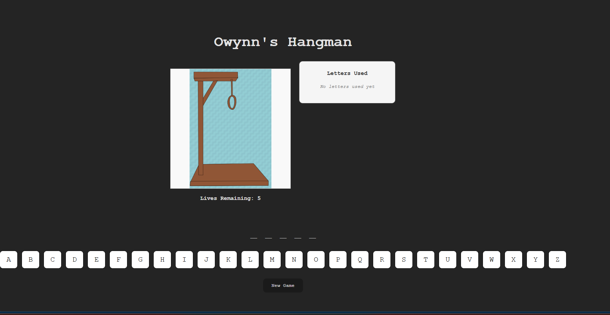

# HangmanSPR26

## Project Overview

This is a Hangman game built using React (class components). The application allows users to guess letters to reveal a hidden word while tracking remaining lives through a visual hangman drawing.

The project focuses on core React concepts including state management, component structure, props, and conditional rendering.

## Screenshot



---

## Features

* Interactive letter selection (A–Z)
* Dynamic word display with hidden letters
* Lives system with visual hangman progression (6 states)
* Win/Loss detection with popup messages
* New Game reset functionality
* Modular component-based architecture

---

## Component Structure

The application is organized into reusable components:

* App.jsx → Main state controller (single source of truth)
* HangmanDrawing.jsx → Displays hangman images based on lives
* WordDisplay.jsx → Shows correctly guessed letters
* LetterBox.jsx → Renders alphabet grid
* LetterButton.jsx → Individual letter buttons
* GameStatusModal.jsx → Win/Loss popup
* NewGameButton.jsx → Resets the game

---

## State Management

The main game state is managed in App.jsx:

* word → current word to guess
* guessedLetters → letters selected by user
* lives → remaining attempts
* gameStatus → "playing", "won", or "lost"

---

## Running the App Locally

1. Install dependencies:

```
npm install
```

2. Start development server:

```
npm run dev
```

3. Open in browser:

```
http://localhost:5173
```

---

## Running with Docker

1. Build the image:

```
docker build -t hangman-app .
```

2. Run the container:

```
docker run -p 5173:5173 hangman-app
```

3. Open:

```
http://localhost:5173
```

---

## Hangman Images

Images are stored in the public/hangman/ directory and mapped to lives:

* 5 lives → empty gallows
* 0 lives → full hangman

